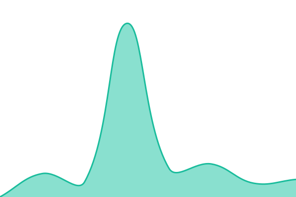
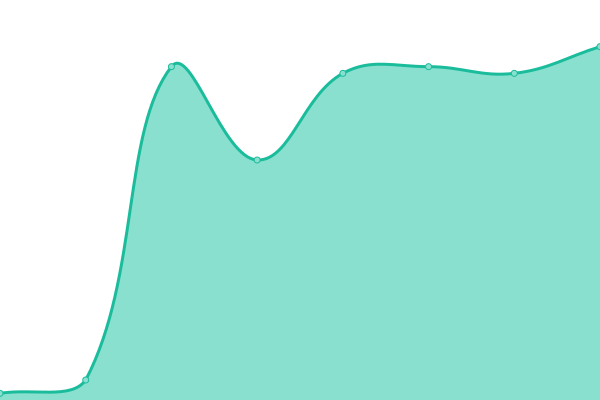
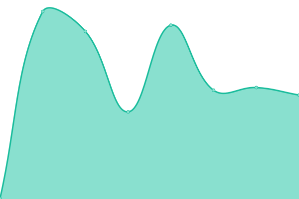
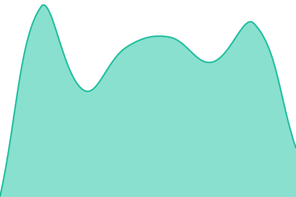
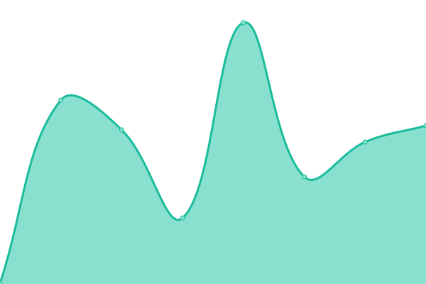
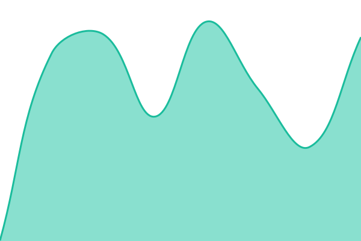

# [📈 Live Status](https://nvesportseducationleague.org): <!--live status--> **🟧 Partial outage**

This repository contains the open-source uptime monitor and status page for [Nevada Esports Education League](https://nvesportseducationleague.org), powered by [Upptime](https://github.com/upptime/upptime).

With [Upptime](https://upptime.js.org), you can get your own unlimited and free uptime monitor and status page, powered entirely by a GitHub repository. We use [Issues](https://github.com/Nevada-Esports-Education-League/status/issues) as incident reports, [Actions](https://github.com/Nevada-Esports-Education-League/status/actions) as uptime monitors, and [Pages](https://nvesportseducationleague.org) for the status page.

<!--start: status pages-->
<!-- This summary is generated by Upptime (https://github.com/upptime/upptime) -->
<!-- Do not edit this manually, your changes will be overwritten -->
<!-- prettier-ignore -->
| URL | Status | History | Response Time | Uptime |
| --- | ------ | ------- | ------------- | ------ |
|  [Website](https://www.nvesportseducationleague.org/) | 🟩 Up | [website.yml](https://github.com/Nevada-Esports-Education-League/status/commits/HEAD/history/website.yml) | 

 446ms
     
 | 

<a href="https://status.nvesportseducationleague.org/history/website">100.00%</a>
    

|  [Minecraft Server](play.nvesportseducationleague.org) | 🟩 Up | [minecraft-server.yml](https://github.com/Nevada-Esports-Education-League/status/commits/HEAD/history/minecraft-server.yml) | 

 40ms
     
 | 

<a href="https://status.nvesportseducationleague.org/history/minecraft-server">100.00%</a>
    

|  [Bluemap](https://bluemap.nvesportseducationleague.org) | 🟩 Up | [bluemap.yml](https://github.com/Nevada-Esports-Education-League/status/commits/HEAD/history/bluemap.yml) | 

 288ms
     
 | 

<a href="https://status.nvesportseducationleague.org/history/bluemap">100.00%</a>
    

|  [Docuseal](https://docuseal.nvesportseducationleague.org) | 🟩 Up | [docuseal.yml](https://github.com/Nevada-Esports-Education-League/status/commits/HEAD/history/docuseal.yml) | 

 359ms
     
 | 

<a href="https://status.nvesportseducationleague.org/history/docuseal">100.00%</a>
    

|  [Element](https://element.nvesportseducationleague.org) | 🟩 Up | [element.yml](https://github.com/Nevada-Esports-Education-League/status/commits/HEAD/history/element.yml) | 

 624ms
     
 | 

<a href="https://status.nvesportseducationleague.org/history/element">100.00%</a>
    

|  [Forgejo](https://git.nvesportseducationleague.org) | 🟥 Down | [forgejo.yml](https://github.com/Nevada-Esports-Education-League/status/commits/HEAD/history/forgejo.yml) | 

 182ms
     
 | 

<a href="https://status.nvesportseducationleague.org/history/forgejo">0.00%</a>
    

|  [OpenAudioMC](https://endpoint.nvesportseducationleague.org) | 🟩 Up | [open-audio-mc.yml](https://github.com/Nevada-Esports-Education-League/status/commits/HEAD/history/open-audio-mc.yml) | 

 204ms
     
 | 

<a href="https://status.nvesportseducationleague.org/history/open-audio-mc">100.00%</a>
    

|  [Pelican](https://pelican.nvesportseducationleague.org) | 🟩 Up | [pelican.yml](https://github.com/Nevada-Esports-Education-League/status/commits/HEAD/history/pelican.yml) | 

 511ms
     
 | 

<a href="https://status.nvesportseducationleague.org/history/pelican">100.00%</a>
    

|  [Shelf](https://shelf.nvesportseducationleague.org) | 🟥 Down | [shelf.yml](https://github.com/Nevada-Esports-Education-League/status/commits/HEAD/history/shelf.yml) | 

 598ms
     
 | 

<a href="https://status.nvesportseducationleague.org/history/shelf">15.73%</a>
    

|  [Vault](https://vault.nvesportseducationleague.org) | 🟩 Up | [vault.yml](https://github.com/Nevada-Esports-Education-League/status/commits/HEAD/history/vault.yml) | 

 328ms
     
 | 

<a href="https://status.nvesportseducationleague.org/history/vault">100.00%</a>
    

|  [n8n](https://n8n.nvesportseducationleague.org) | 🟩 Up | [n8n.yml](https://github.com/Nevada-Esports-Education-League/status/commits/HEAD/history/n8n.yml) | 

 323ms
     
 | 

<a href="https://status.nvesportseducationleague.org/history/n8n">100.00%</a>
    

<!--end: status pages-->

[**Visit our status website →**](https://nvesportseducationleague.org)

## 📄 License

- Powered by: [Upptime](https://github.com/upptime/upptime)
- Code: [MIT](./LICENSE) © [Anand Chowdhary](https://anandchowdhary.com), supported by [Pabio](https://pabio.com)
- Data in the `./history` directory: [Open Database License](https://opendatacommons.org/licenses/odbl/1-0/)
